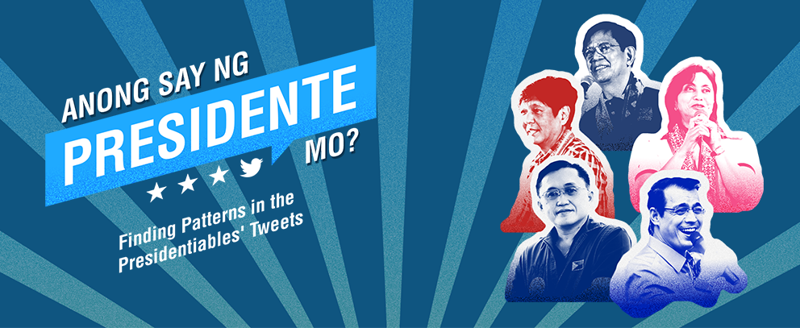
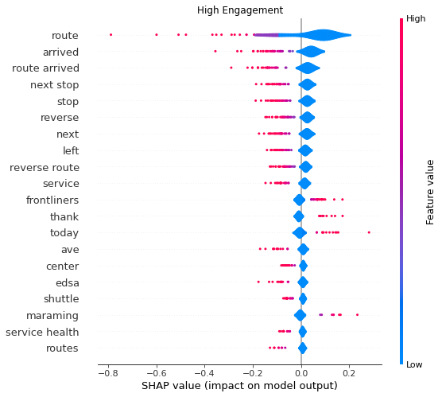
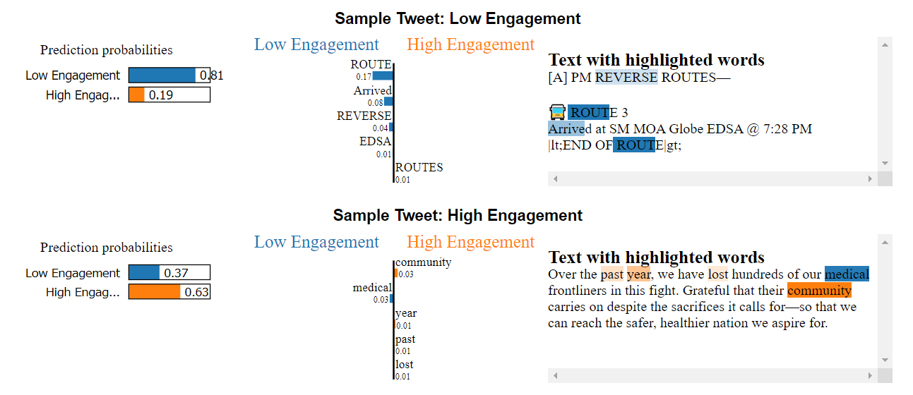
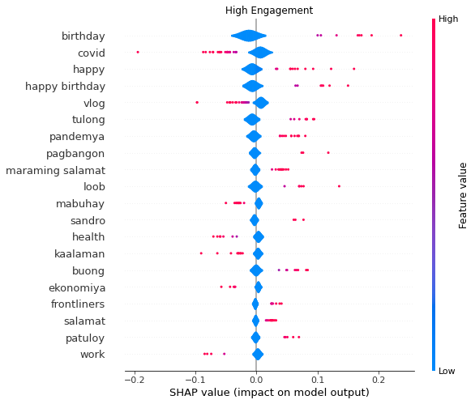
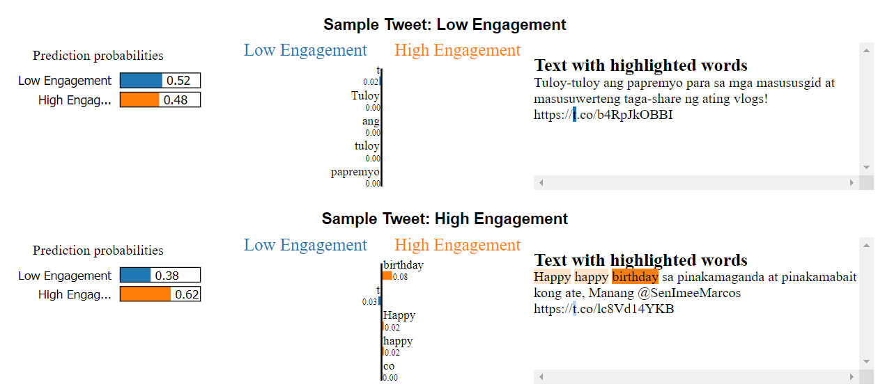

# Finding Patterns in the Presidentiables Tweets

Machine Learning Final Project by Gabriel Lorenzo Cadena, Amos Changcoco, Patrick Guillano La Rosa, Maria Elvira Paderes, Geriandre Piquero, Bonnie Jenniedy Ruiz - December 04, 2021. The code, analysis, and the full report are included in the <a href="https://github.com/pgplarosa/Finding-Patterns-in-the-Presidentiables-Tweets/blob/main/ML2%20Final%20Report.html">Technical Report</a>. If you have any questions regarding this study, please send me a message via  <a href="https://www.linkedin.com/in/patricklarosa/">LinkedIn</a>.

## Highlights

1. Since social media is regarded as the new TV, Twitter has the potential to influence its users' political views.
2. As the election season has only begun, the presidentiables have yet to leverage their Twitter presence.
3. Each presidential candidate has distinct topics, styles, and word choices in their tweets.
4. The candidates’ followers value original and personalized content, as well as an uninterrupted Twitter experience.
5. Interpretability methods allow for a clear grasp of the business value of model outcomes.

## Sample Results
Outputs of other presidentiables and methods can be seen in the <a href="https://github.com/pgplarosa/Finding-Patterns-in-the-Presidentiables-Tweets/blob/main/ML2%20Final%20Report.html">Technical Report</a>.
<table> 
<tr>
<td colspan=2><b>Leni Robredo</b></td>
</tr>
<tr>
<td></td>
<td></td>
</tr>
<tr>
<td colspan=2><b>Bongbong Marcos</b></td>
</tr>
<tr>
<td></td>
<td></td>
</tr>
</table>

